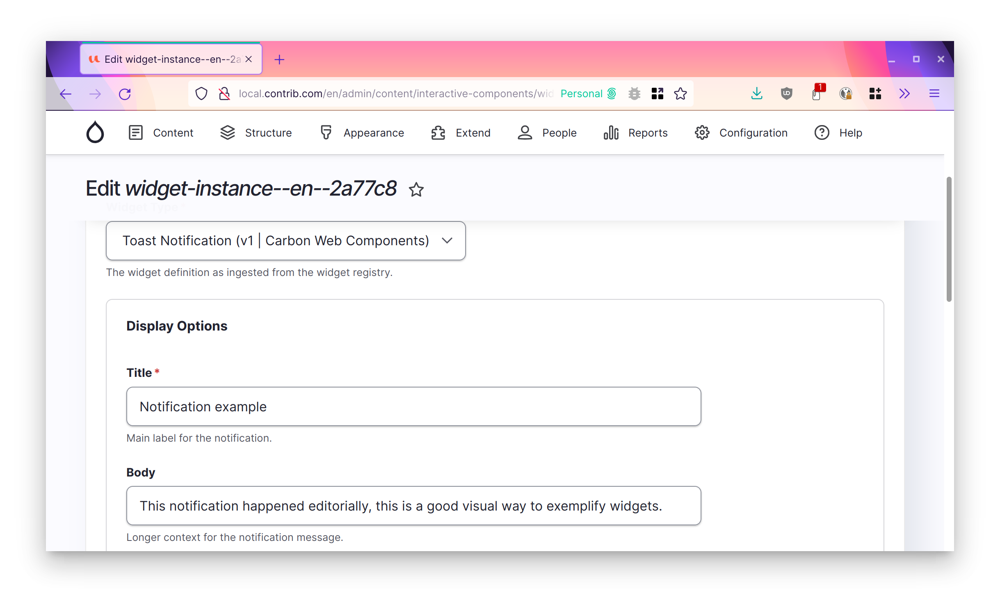

:::info
This section focuses on the [Drupal integration](https://www.drupal.org/project/widget_instance). In the future other
CMS integrations may exist.
:::

Widget instances are the JavaScript applications that get rendered in the CMS pages. You will likely have many instances
of the same [widget type](./widget-types). Widget instances are the result of filling in the editorial input on the
widget type.

Finally, when an end user visits the site (managed by the CMS) they will see the component with the editorial data.

