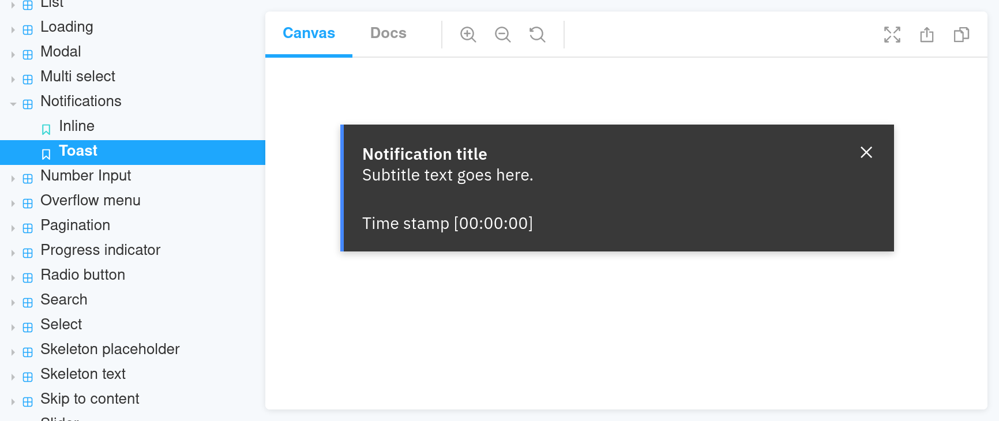

import Link from "@docusaurus/Link";

Once you have [configured the registry](./config/declare-registry) it's time to create a widget definitions for one of
your components.

Imagine you have a _Toast Notification_ component, [like this one](https://www.carbondesignsystem.com/components/notification/usage#toast-notifications). This is what it looks like in Storybook:



## Widget Definition File
Widget definition files are the files matched by [the `register` pattern](config/options/register) in the registry
configuration. They usually match the pattern `*.widget.js`. So if we want to create a widget for the notification, we
will need to create `src/components/notification/toast-notification.widget.js`. This leaves us with:

```shell
src/components/notification/toast-notification.ts
src/components/notification/toast-notification.scss
// highlight-next-line
src/components/notification/toast-notification.widget.js
```

```js title="src/components/notification/toast-notification.widget.js"
module.exports = {
  shortcode: 'toast-notification',
  title: 'Toast Notification',
  description: 'A notification element with a bit more context than the inline notification.',
  status: 'wip'
};
```

All the options are described in the schema and documented in [its own documentation site](https://js-widgets.github.io/js-widgets/registry-schema/).

<Link
  className="button button--secondary button--lg"
  to="https://js-widgets.github.io/js-widgets/registry-schema/">
  Documentation Site
</Link>

## Configurable Options
One of the most powerful features of widgets is that they allow JS developers to expose component props to CMS
editors.

In our _Toast Notification_ example this translate in letting editors choose the `title` of the notification, the
`body`, `caption`, and the notification `kind`.

These options are defined in the widget definition file. As a widget developer you need to describe the input CMS
editors will have available. Then in the [_render file_](./render-file) you will take that eventual editorial input
and feed it to the component.

The widget definition file needs to contain the necessary information for the CMS integration to render a form. The CMS
will be responsible to parse the widget registry, take the section for the widget definition, inspect the
`settingsSchema` property, and present a form to the editor appropriate to collect that input.

The syntax to describe the configurable options is the [JSON Schema standard](https://json-schema.org).

Let's add three text boxes and one radio button to collect the _Toast Notification_ options.

```js title="src/components/notification/toast-notification.widget.js"
module.exports = {
  // entry defaults to 'index.js' but you can change it to any other location.
  // entry: path.join(__dirname, 'render-toast-notification.js'),
  shortcode: 'toast-notification',
  title: 'Toast Notification',
  description: 'A notification element with a bit more context than the inline notification.',
  preview: {
    url: 'https://example.org/storybook/iframe.html?id=widgets-toast-notification-components--default&viewMode=story',
  },
  status: 'wip',
  usesExternalPeerDependencies: ['react', 'react-dom'],
  // highlight-start
  settingsSchema: {
    type: 'object',
    additionalProperties: false,
    properties: {
      fields: {
        type: 'object',
        required: ['title'],
        properties: {
          title: {
            type: 'string',
            maxLength: 255,
            title: 'Title',
            description: 'Main label for the notification.',
          },
          description: {
            type: 'string',
            title: 'Body',
            description: 'Longer context for the notification message.',
          },
          caption: {
            type: 'string',
            title: 'Caption',
          },
          kind: {
            type: 'string',
            title: 'Notification kind',
            enum: ['success', 'info', 'warning', 'error'],
          },
        },
      },
    },
  },
  // highlight-end
};
```

This will end up on the CMS as:


---

Properties:

  - [`shortcode`](https://js-widgets.github.io/js-widgets/registry-schema/#items_shortcode)
  - [`title`](https://js-widgets.github.io/js-widgets/registry-schema/#items_title)
  - [`description`](https://js-widgets.github.io/js-widgets/registry-schema/#items_description)
  - [`status`](https://js-widgets.github.io/js-widgets/registry-schema/#items_status)
  - [`settingsSchema`](https://js-widgets.github.io/js-widgets/registry-schema/#items_settingsSchema)
  - `usesExternalPeerDependencies` (`string[]`): The list of keys of [external peer dependencies](./config/options/allExternalPeerDependencies) this widget uses.
  - `entry` (`string`): the path to [the render file](./render-file) for the component. Default: `./index.js`.
